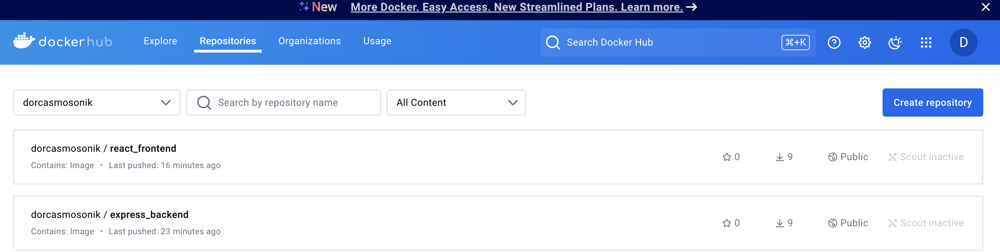

# E-Commerce Web Application Setup with Ansible

## Overview

This project involves setting up an e-commerce web application that acts as a dashboard for managing retail products. The setup utilizes Vagrant for provisioning a virtual machine and Ansible for configuration management. The application allows users to add products via a form, providing core e-commerce functionalities.

## Table of Contents

- [Project Structure](#project-structure)
- [Getting Started](#getting-started)
  - [Prerequisites](#prerequisites)
  - [Cloning the Repository](#cloning-the-repository)
  - [Provisioning the Vagrant VM](#provisioning-the-vagrant-vm)
  - [Running the Ansible Playbook](#running-the-ansible-playbook)
- [Navigating the Project](#navigating-the-project)
- [Key Features](#key-features)
- [Accessing the Application](#accessing-the-application)
- [Conclusion](#conclusion)
- [License](#license)

## Project Structure

The repository includes the following key components:

```
├── .vagrant
├── .vscode
├── backend
├── client
├── roles
├── .dockerignore
├── .gitignore
├── README.md
├── Vagrantfile
├── ansible.cfg
├── docker-compose.yml
├── dockerImage.png
├── explanation.md
├── get-docker.sh
├── hosts
├── inventory
├── main.yml
├── package-lock.json
└── package.json
```

- **.vagrant/**: Contains files related to Vagrant's management of the virtual environment.
- **.vscode/**: Configuration files for Visual Studio Code.
- **backend/**: Directory for the backend service components of the application.
- **client/**: Directory for the client-side components of the application.
- **roles/**: Contains subdirectories for different roles that define specific tasks.
- **.dockerignore**: Lists files and directories that should be ignored by Docker.
- **.gitignore**: Lists files and directories that should be ignored by Git.
- **README.md**: Documentation for the project.
- **Vagrantfile**: Configuration for the Vagrant virtual machine.
- **ansible.cfg**: Ansible configuration settings.
- **docker-compose.yml**: Configuration for Docker container orchestration.
- **dockerImage.png**: Screenshot of the Docker image.
- **explanation.md**: Additional explanation of the project components or setup.
- **get-docker.sh**: Script for installing Docker on the VM.
- **hosts**: Initial commit for IP3, defining the hosts and groups for Ansible.
- **inventory**: Defines the hosts and groups for the Ansible playbook.
- **main.yml**: The main Ansible playbook for automating the setup.
- **package-lock.json**: Lock file for npm dependencies.
- **package.json**: Configuration for npm, including scripts and dependencies.

## Getting Started

### Prerequisites

Before you begin, ensure you have the following installed on your machine:

- [Vagrant](https://www.vagrantup.com/downloads)
- [VirtualBox](https://www.virtualbox.org/wiki/Downloads)
- [Ansible](https://www.ansible.com/products/ansible)

### Cloning the Repository

To clone the project repository, run the following command in your terminal:

```bash
git clone <repository_url>
cd <repository_name>
```

### Provisioning the Vagrant VM

To create and start the Vagrant virtual machine, use the command:

```bash
vagrant up
```

This command provisions a VM running Ubuntu 20.04 with the configurations specified in the `Vagrantfile`.

### Running the Ansible Playbook

Once the VM is up and running, execute the Ansible playbook to set up the application:

```bash
ansible-playbook main.yml
```

This command will:

- Clone the application code from the specified GitHub repository.
- Set up Docker containers for both the backend and frontend services.
- Apply all necessary configurations for a successful deployment.

## Navigating the Project

### Roles

The project is structured into roles that encapsulate specific tasks:

- **frontend/**: Contains tasks related to setting up the frontend service, including Docker configurations.
- **backend/**: Contains tasks for setting up the backend service.
- **common/**: Includes shared tasks and configurations used by both frontend and backend roles.

### Files and Configuration

- **docker-compose.yml**: This file defines the services, networks, and volumes for the application.
- **deployment YAML files**: These files contain Kubernetes configurations for deploying the application in a container orchestration environment.
- **get-docker.sh**: A script to install Docker and configure it on the VM automatically.

## Key Features

- **Docker Containerization**: Each service is encapsulated in its own Docker container for easy deployment and scalability.
- **Automated Setup with Ansible**: The use of Ansible playbooks automates the configuration of the application environment, making it reproducible.
- **Modular Design**: Organized roles and tasks promote maintainability and code readability.
- **Version Control**: All changes are tracked using Git for better collaboration and history management.

## Accessing the Application

After the playbook has successfully run, you can access the application in your web browser:

```
http://<vagrant_ip>:<port>
```

- Replace `<vagrant_ip>` with the IP address assigned to your Vagrant VM (usually `192.168.33.10`).
- Replace `<port>` with the port number configured in your Docker setup (commonly `80` for HTTP).

## Screenshot


## Conclusion

This project showcases the ability to provision a virtual environment using Vagrant, configure an application with Ansible, and deploy it using Docker. The e-commerce functionality provides a hands-on experience for users to manage retail products effectively.

## License

This project is licensed under the MIT License. See the [LICENSE](LICENSE) file for more details.
